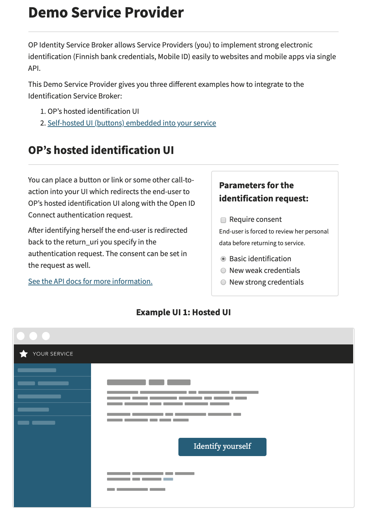
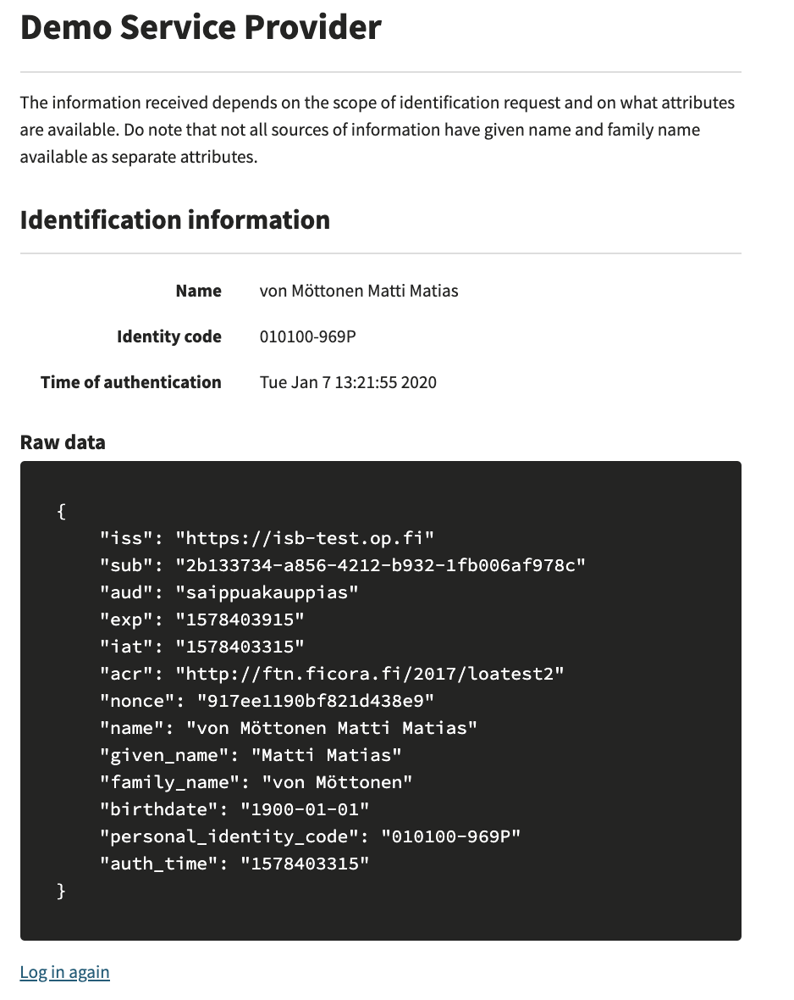

# Service Provider integration example for the OP Identity Service Broker

This repository provides an easy way to test OP identification
services. It also serves as a PHP-based implementation example to help Servide Providers (SP) to integrate to the OP Identitity Service Broker (ISB). 

This example project provides an easy way to test the OP Identity Service Broker. The example contains integration codes written in Python and gives an in-depth presentation of the things that a service provider must implement on their own service in order to integrate into the OP identity service broker. This example is for service providers whose application is built with Python.

This example is the OP Demo Service Provider, which runs in a Docker container and it connects with the OP ISB sandbox environment.

This Demo Service Provider gives you three different examples how to integrate to the OP's Identity Service Broker:
- OP's hosted Identification UI
- Embedded identification UI with buttons
- Embedded identification UI with dropdown

## OP's hosted Identification UI

In this example the Identification UI is hosted by the OP's Identity Service Broker. Authorization is started by clicking the "Identify Yourself" - button shown on the UI.

## Embedded identification UI with buttons

In this example the Identification UI is embedded into the Demo Service Provider. Authorization request is sent by clicking one of the Identity Provider buttons shown on the UI.

## Embedded identification UI with dropdown

In this example the Identification UI is embedded into the Demo Service Provider. Authorization request is sent by by choosing an Identity Provider from the dropdown menu shown on the UI.

## Additional parameters for testing purposes

In all three examples it is possible to select the identification purpose (See the scope-parameter in the flow chapter of the API-document):
- normal
- weak (for weak identifiers, for example user account with user-id and password)
- strong (for official strong authentication)

In your implementation there won't be such selection for the end users. The purpose selection is there to illustrate how it looks like at the code level and in the interface between the SP and the ISB when the SP is using such purpose. SP needs to use one of these three methods when initiating the identification process with the ISB.

In all three examples it is also possible to select whether consent is required or not (See the consent-parameter in the flow chapter of the API-document). In your implementation there won't be such selection for the end users. The consent parameter is there to illustrate how it looks like in the code level, in the ISB UI and in the interface between the SP and the ISB when the SP is requesting consent to be requested from the end users during the identification process. It is up to the SP to decide during the implementation phase whether to request this consent or not.


Screenshot for the Service Provider example:



Identification done:




## Differences between the sandbox and the production environment

The sandbox environment uses fixed SP keys (key pair for signature and encryption). In a production environment, it is up to the service provider to create the keys and publish the public keys to the authentication proxy service at the JWKS endpoint.

In the sandbox environment, all autentication methods are displayed. Only the authentication methods that the customer has agreed with OP will be displayed in the production environment.

There is no return URL check in the sandbox environment. In a production environment, the return URL must be in agreement, otherwise the authentication transaction will fail.

## Tunnistuksen toteutuksesta

Sandbox environment endpoints
- AUTHORIZE_ENDPOINT='https://isb-test.op.fi/oauth/authorize'
- TOKEN_ENDPOINT='https://isb-test.op.fi/oauth/token'
- ISBKEY_ENDPOINT='https://isb-test.op.fi/jwks/broker'
- ISBEMBEDDED_ENDPOINT='https://isb-test.op.fi/api/embedded-ui/'

1) The sandbox environment uses a fixed key pair on the service provider side. The service provider signs the authentication request with its own private key and sends it to the identity service broker (http redirect)

NOTE! In production, the identity service broker retrieves the service provider's public key from the provider's jwks end point and verifies the signature and visits the partner registry for the contract information, these checks are not done in the sandbox.  

In this example, point @api.route("/authenticate")

2) The embedded function sends an extra attribute ftn_idp_id = <idp-name>, which allows the identity service broker to automatically redirect the user to the selected identity provider. The extra attribute prompt = consent tells the identity service broker that the user wants to check the information being passed

3) After authentication, the identity service broker generates an authentication token, signs it with its own private key and encrypts it with the ISP's public key (see NOTE in the sandbox for fixed keys) and sends the token to the ISP (http redirect). In this example, point @api.route("/return")

4) The service provider retrieves the ISB public keys from the proxy jwsk interface, the ISB key used for signature from the header of the token, decrypts with its own private key and finally verifies the signature with the public key of the ISB.

Note: The signature key used must be checked because there may be multiple keys due to key rotation.

## Requirements
- Docker and Docker Compose need to be installed on the host computer. See https://www.docker.com/get-docker
- Port 80 needs to be free on the host computer

## Documentation

The OP Identity Service Broker (ISB) API-documentation is available here. See https://github.com/op-developer/Identity-Service-Broker-API .

## Security limitations

Please note that this integration example demo application has the following identified security issues:
- The following security headers are missing (in production these should be set properly):
    - The anti-clickjacking X-Frame-Options header.
    - The X-XSS-Protection header is not defined. This header can hint to the user agent to protect against some forms of XSS
    - The X-Content-Type-Options header is not set. This could allow the user agent to render the content of the site in a different fashion to the MIME type
    - HTTP Strict-Transport-Security header is not set. This demo application uses http, not https. https has to be used in production and then this header is mandatory
- The demo application is run as root in the Docker container. In production, the application should be run as non-root
- The error page is vulnerable to reflected Cross-site scripting. In production there should be input validation and output encoding.
- demo application information leakage. It is possible to get some details about the system by using malformed input parameters, or in certain case, by calling the same method again with the same information. Also errors expose details on purpose to help the integration work. In production there should be user input validations and errors should not expose details of the system.
- nonce in ID Token is not checked against the one that was given in oauth/authorize

## Usage

On the host computer give the following commands:

```bash
git clone <repo-url> my-isb-test
cd my-isb-test
docker-compose up --build
```

When the container is up and running, please open the browser and go to the http://localhost . You can move between the three different UI examples following links in the UI.
