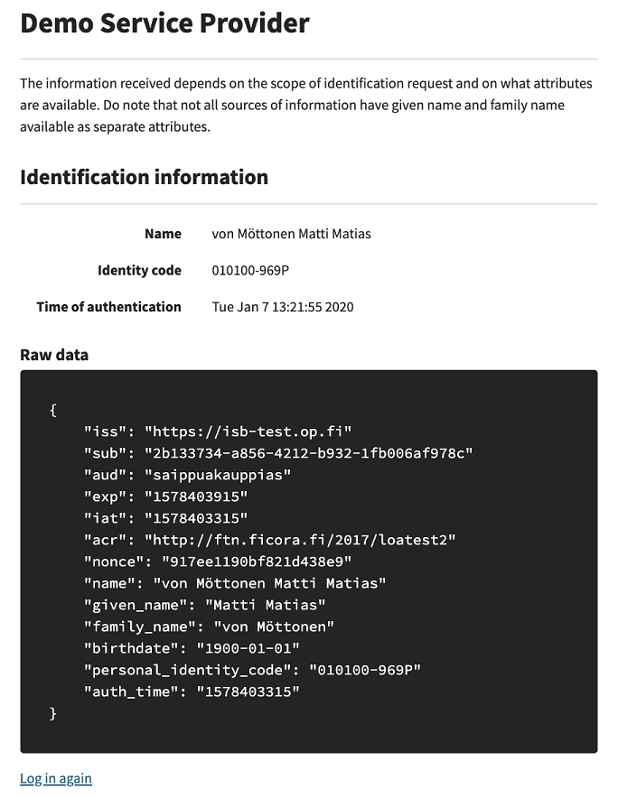

# Palveluntarjoajan integraatioesimerkki OP:n tunnistuksen välityspalveluun

Tämä esimerkkiprojekti tarjoaa helpon tavan testata OP:n tunnistuksen välityspalvelua. Esimerkki sisältää integroitumiskoodit, jotka on kirjoitettu Python -kielellä, ja esittelee seikkaperäisesti asiat, jotka palveluntarjoajan on toteutettava omaan palveluun, jotta hän voi integroitua tunnistuksen välityspalveluun. Esimerkki on tarkoitettu palveluntarjoajille, joiden sovellus on rakennettu Pythonilla, ja koodi on helposti upotettavissa osaksi palveluntarjoajan sovellusta.

Tämä esimerkki on integraatioesimerkki OP:n hiekkalaatikkoympäristöön. Hiekkalaatikko- ja tuotantoympäristön välillä on joitakin eroja, jotka palveluntarjoajan on huomioitava, jotta sovellus toimii myös tuotantoympäristössä.

Tämän esimerkin avulla palveluntarjoaja voi tarjota tunnistuspalvelun

- OP:n tunnistusseinällä
- Omille sivuille lisätyillä tunnistusnapeilla

## OP:n tunnistusseinä

Tässä esimerkissä tunnistusseinän tarjoaa OP:n tunnistuksen välityspalvelu. Tunnistautuminen aloitetaan palveluntarjoajan sivuilta ”Identity yourself” -nappulasta. Tämän jälkeen tunnistautuja ohjataan OP:n tunnistuksen välityspalvelun tarjoamalle tunnistusseinälle. Sieltä tunnistautuja valitsee halutun tunnistusvälineen ja jatkaa tunnistautumiseen.

## Sulautetut tunnistusnapit palveluntarjoajan omilla sivuilla

Tässä esimerkissä asiakkaan valitsemat tunnistusmenetelmät näkyvät sulautettuina nappeina palveluntarjoajan sivuilla. Tunnistautuminen suoritetaan valitsemalla palveluntarjoajan sivulta haluttu tunnistusmenetelmä, jonka jälkeen tunnistautuja ohjataan tunnistuksen välityspalvelun kautta suoraan valittuun tunnistuspalveluun ja tunnistautuja voi aloittaa tunnistautumisen.

## Lisäparametrit testausta varten

Tämä esimerkki tarjoaa myös lisäparametrit testaustarkoituksia varten

- "Require concent": Tunnistautujalle näytetään palvelulle välitettävät tiedot ennen kuin ne välitetään eteenpäin. Tunnistautuja voi peruuttaa halutessaan tunnistustapahtuman
- "Identification / normal": Tämä on normaali tunnistus
- "Identification / weak": Pyydetään tunnistuksen välityspalvelua luomaan palveluntarjoajalle heikot tunnukset 
- "Identification / strong": Pyydetään tunnistuksen välityspalvelua luomaan palveluntarjoajalle vahvat tunnukset

In your implementation there won't be such selection for the end users. The purpose selection is there to illustrate how it looks like at the code level and in the interface between the SP and the ISB when the SP is using such purpose. SP needs to use one of these three methods when initiating the identification process with the ISB.

Screenshot for the Service Provider example:


Identification done:



## Hiekkalaatikko- ja tuotantoympäristön erot

Hiekkalaatikkoympäristössä käytetään kiinteitä SP:n avaimia (avainpari allekirjoitukseen ja salaukseen). Tuotantoympäristössä palveluntarjoajan on itse huolehdittava avaimien luomisesta ja julkaistava julkiset avaimet tunnistuksen välityspalvelulle JWSK -endpointissa.

Hiekkalaatikkoympäristössä näytetään kaikki tunnistusmenetelmät. Tuotantoympäristössä näytetään vain ne tunnistusmenetelmät, jotka asiakas on sopinut OP:n kanssa. 

Hiekkalaatikkoympäristössä paluu URL:n tarkistusta ei ole. Tuotantoympäristössä paluu URL:n on oltava sopimuksen mukainen, muutoin tunnistustapahtuma epäonnistuu.

## Tunnistuksen toteutuksesta

- Hiekkalaatikko (sandbox) ympäristön endpointit
- AUTHORIZE_ENDPOINT='https://isb-test.op.fi/oauth/authorize'
- TOKEN_ENDPOINT='https://isb-test.op.fi/oauth/token'
- ISBKEY_ENDPOINT='https://isb-test.op.fi/jwks/broker'
- ISBEMBEDDED_ENDPOINT='https://isb-test.op.fi/api/embedded-ui/'

1) Hiekkalaatikko (sandbox) ympäristössä käytetään palveluntarjoajan puolella kiinteää avainparia. palveluntarjoaja allekirjoittaa tunnistuspyynnön omalla salaisella avaimella ja lähettää sen tunnistuksen välityspalvelulle (http uudelleenohjaus)
HUOM! Tuotannossa tunnistuksen välityspalvelu hakee palveluntarjoajan jwks end pointista palveluntarjoajan julkisen avaimen ja varmentaa allekirjoituksen ja käy katsomassa kumppanirekisteristä sopimustiedot, näitä tarkistuksia ei tehdä hiekkalaatikossa (sandbox)  
Tässä esimerkissä kohta @api.route("/authenticate")

2) Embedded toiminnossa lähetetään ylimääräinen attribuutti ftn_idp_id = <välineen nimi>, jonka perusteella tunnistuksen välityspalvelu osaa automaattisesti ohjata käyttäjän valitulle tunnistusvälineelle. Ylimääräisellä attribuutilla prompt=consent kerrotaan tunnistuksen välityspalvelulle, että käyttäjä haluaa tarkistaa välitettävät tiedot

3) Tunnistuksen jälkeen tunnistuksen välityspalvelu tuottaa autentikaatiotokenin, allekirjoittaa sen omalla salaisella avaimella ja salaa sen palveluntarjoajan julkisella avaimella (katso kohta HUOM! hiekkalaatikossa kiinteät avaimet) ja lähettää tokenin palveluntarjoajalle (http uudelleenohjaus)
Tässä esimerkissä kohta @api.route("/return")

4) Palveluntarjoaja hakee välityspalvelun jwsk -rajapinnasta välityspalvelun julkiset avaimet, tokenin otsikkotiedoista (header) allekirjoitukseen käytetyn välityspalvelun avaimen, purkaa omalla salaisella avaimella salauksen ja lopuksi tarkistaa allekirjoituksen välityspalvelun julkisella avaimella. 

Huom: käytetty allekirjoitusavain on tarkistettava, koska avaimia voi olla avainrotaation takia useita.

## Documentation

The OP Identity Service Broker (ISB) API-documentation is available here. See https://github.com/op-developer/Identity-Service-Broker-API .

## Security limitations

Please note that this integration example demo application has the following identified security issues:
- The following security headers are missing (in production these should be set properly):
    - The anti-clickjacking X-Frame-Options header.
    - The X-XSS-Protection header is not defined. This header can hint to the user agent to protect against some forms of XSS
    - The X-Content-Type-Options header is not set. This could allow the user agent to render the content of the site in a different fashion to the MIME type
    - HTTP Strict-Transport-Security header is not set. This demo application uses http, not https. https has to be used in production and then this header is mandatory
- The demo application is run as root in the Docker container. In production, the application should be run as non-root
- Cookie is not protected. In production the httpOnly flag must be added to the PHPSESSID cookie
- The error page is vulnerable to reflected Cross-site scripting. In production there should be input validation and output encoding.
- demo application information leakage. It is possible to get some details about the system by using malformed input parameters, or in certain case, by calling the same method again with the same information. Also errors expose details on purpose to help the integration work. In production there should be user input validations and errors should not expose details of the system.
- nonce in ID Token is not checked against the one that was given in oauth/authorize

## Usage

On the host computer give the following commands:

```bash
git clone <repo-url> my-isb-test
cd my-isb-test
docker-compose up --build
```

When the container is up and running, please open the browser and go to the http://localhost . You can move between the three different UI examples following links in the UI.
